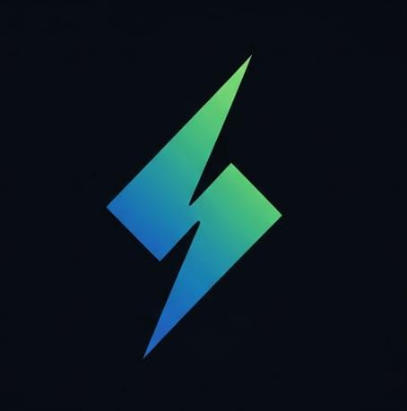

# 🚀 Surge - Web3 P2P Gaming Platform



**Surge** is a cutting-edge Web3 P2P gaming platform built on the CELO blockchain, offering skill-based challenges with real cryptocurrency rewards. Experience the future of decentralized gaming where players compete, stake, and win in a fair, transparent environment.

## 🌟 Features

- **🎮 Skill-Based Gaming**: Compete in fair, skill-based challenges
- **💰 Real Rewards**: Win real cryptocurrency prizes
- **🔗 Decentralized**: Built on CELO blockchain for transparency
- **⚡ Real-Time**: WebSocket-powered multiplayer gaming
- **🔐 Secure**: Smart contract-based prize distribution
- **📱 Responsive**: Works on desktop and mobile devices

## 🏗️ Tech Stack

- **Frontend**: Next.js 16, React 19, TypeScript
- **Styling**: Tailwind CSS, shadcn/ui components
- **Blockchain**: CELO network, Wagmi, Viem
- **Authentication**: Firebase Auth
- **Real-time**: WebSocket server
- **Wallet**: WalletConnect, MetaMask support

## 📋 Prerequisites

- Node.js 18+ 
- pnpm package manager
- CELO wallet (MetaMask, Valora, etc.)
- Git

## 🚀 Quick Start

### 1. Clone the Repository

```bash
git clone <repository-url>
cd Surge
```

### 2. Install Dependencies

```bash
pnpm install
```

### 3. Environment Setup

Create a `.env.local` file in the root directory:

```env
# App Configuration
NEXT_PUBLIC_APP_URL=http://localhost:3000
NEXT_PUBLIC_WC_PROJECT_ID=your_walletconnect_project_id

# Firebase Configuration
NEXT_PUBLIC_FIREBASE_API_KEY=your_firebase_api_key
NEXT_PUBLIC_FIREBASE_AUTH_DOMAIN=your_firebase_auth_domain
NEXT_PUBLIC_FIREBASE_PROJECT_ID=your_firebase_project_id
NEXT_PUBLIC_FIREBASE_STORAGE_BUCKET=your_firebase_storage_bucket
NEXT_PUBLIC_FIREBASE_MESSAGING_SENDER_ID=your_firebase_messaging_sender_id
NEXT_PUBLIC_FIREBASE_APP_ID=your_firebase_app_id
NEXT_PUBLIC_FIREBASE_MEASUREMENT_ID=your_firebase_measurement_id

# Smart Contract Configuration
NEXT_PUBLIC_SURGE_GAMING_CONTRACT=0xae63Cd90dBA5014588228Db306aFBd5Cb6A856E2
NEXT_PUBLIC_CHAIN_ID=11142220

# Network RPC URLs
CELO_SEPOLIA_RPC=https://forno.celo-sepolia.celo-testnet.org
CELO_MAINNET_RPC=https://forno.celo.org
```

### 4. Run Development Server

```bash
pnpm run dev
```

This will start:
- Next.js development server on `http://localhost:3000`
- WebSocket server on `http://localhost:8080`

## 🔗 Smart Contract

### Contract Address
```
0x839595349fc4b54dbed8db3c96f26db6267e6bc5

```

### Network
- **Network**: CELO Sepolia Testnet
- **Chain ID**: 11142220
- **Explorer**: [View on Celoscan](https://sepolia.celoscan.io/address/0x839595349fc4b54dbed8db3c96f26db6267e6bc5)

### Contract Functions
- `createGame()` - Create a new gaming challenge
- `joinGame()` - Join an existing game
- `submitScore()` - Submit your game score
- `claimReward()` - Claim your winnings
- `stake()` - Stake tokens for higher rewards

## 🎮 Available Games

1. **Memory Match Game** - Test your memory skills
2. **Number Memory Game** - Challenge your number recall
3. **Pattern Predictor Game** - Predict the next pattern
4. **Reflex War Game** - Test your reaction time
5. **Word Scramble Game** - Unscramble words for points

## 🛠️ Development

### Project Structure

```
Surge/
├── app/                    # Next.js app directory
├── components/             # React components
│   ├── ui/                # shadcn/ui components
│   ├── games/             # Game components
│   └── ...                # Other components
├── hooks/                 # Custom React hooks
├── lib/                   # Utility functions
├── public/                # Static assets
├── styles/               # Global styles
├── contracts/            # Smart contract files
└── websocket-server.js   # WebSocket server
```

### Available Scripts

```bash
# Development
pnpm run dev              # Start both Next.js and WebSocket server
pnpm run dev:next         # Start only Next.js server
pnpm run websocket-server # Start only WebSocket server

# Production
pnpm run build            # Build for production
pnpm run start            # Start production server

# Code Quality
pnpm run lint             # Run ESLint
```

## 🌐 Deployment

### Vercel Deployment

1. Connect your GitHub repository to Vercel
2. Set environment variables in Vercel dashboard
3. Deploy automatically on push to main branch

### Manual Deployment

```bash
# Build the application
pnpm run build

# Start production server
pnpm run start
```

## 🔧 Configuration

### WalletConnect Setup

1. Visit [WalletConnect Cloud](https://cloud.walletconnect.com/)
2. Create a new project
3. Copy the Project ID to your environment variables

### Firebase Setup

1. Create a Firebase project
2. Enable Authentication and Firestore
3. Copy configuration values to your environment variables

### CELO Network Setup

Add CELO Sepolia to your wallet:

- **Network Name**: CELO Sepolia
- **RPC URL**: `https://forno.celo-sepolia.celo-testnet.org`
- **Chain ID**: `11142220`
- **Currency Symbol**: `CELO`
- **Block Explorer**: `https://sepolia.celoscan.io`

## 🤝 Contributing

1. Fork the repository
2. Create a feature branch (`git checkout -b feature/amazing-feature`)
3. Commit your changes (`git commit -m 'Add amazing feature'`)
4. Push to the branch (`git push origin feature/amazing-feature`)
5. Open a Pull Request

## 📄 License

This project is licensed under the MIT License - see the [LICENSE](LICENSE) file for details.

## 🆘 Support

- **Documentation**: Check the `/docs` folder
- **Issues**: Open an issue on GitHub
- **Discord**: Join our community Discord
- **Email**: support@surge-gaming.com

## 🔗 Links

- **Website**: [https://surge-gaming.com](https://surge-gaming.com)
- **Documentation**: [https://docs.surge-gaming.com](https://docs.surge-gaming.com)
- **Smart Contract**: [View on Celoscan](https://sepolia.celoscan.io/address/0xae63Cd90dBA5014588228Db306aFBd5Cb6A856E2)
- **GitHub**: [https://github.com/surge-gaming/surge](https://github.com/surge-gaming/surge)

## 🙏 Acknowledgments

- CELO Foundation for blockchain infrastructure
- Next.js team for the amazing framework
- shadcn/ui for beautiful components
- Firebase for authentication services
- WalletConnect for wallet integration

---

**Built with ❤️ by the Team LOCALS**

*Experience the future of gaming on CELO blockchain*


