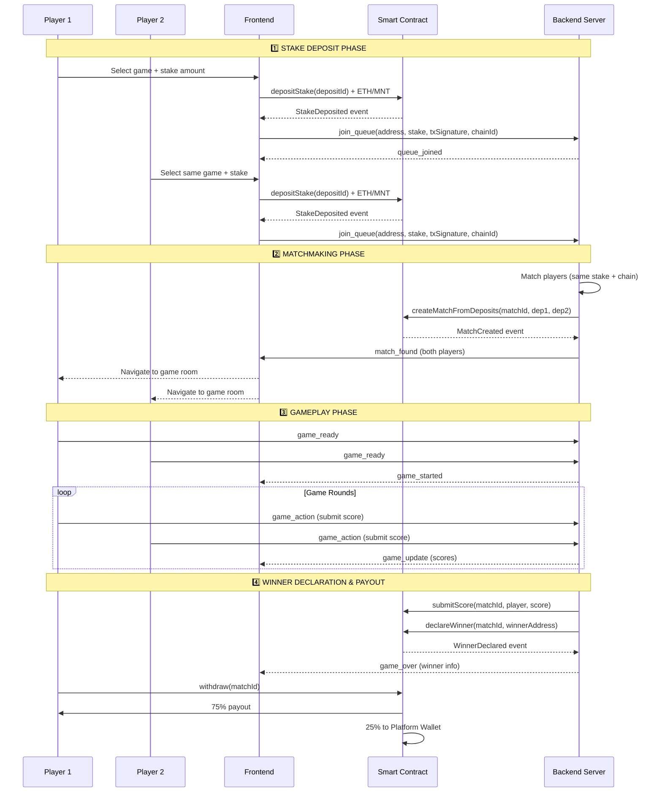

# Surge Gaming ⚡

**Decentralized Pay-Before-Queue Gaming Platform with Multichain Support**


Surge is a trustless gaming platform where players stake ETH/MNT to compete, with winners taking **75%** of the pot while the platform collects **25%** as fees. Built with smart contract escrow and real-time Socket.io matchmaking.

---

## 📦 Live Contract Addresses

| Network | Chain ID | Contract Address | Explorer |
|---------|----------|-----------------|----------|
| **Arbitrum Sepolia** | `421614` | `0x8fD3A16F905dF98907B3739bCD0E31a7949cd2D2` | [View on Arbiscan](https://sepolia.arbiscan.io/address/0x8fD3A16F905dF98907B3739bCD0E31a7949cd2D2) |
| **Mantle Sepolia** | `5003` | `0x6bFe0C83f7924d54A0780F80d2B4561CfbC0B2B1` | [View on MantleScan](https://sepolia.mantlescan.xyz/address/0x6bFe0C83f7924d54A0780F80d2B4561CfbC0B2B1) |

> **Platform Wallet:** `0xFE13B060897b5daBbC866C312A6839C007d181fB`

---

## 🏗️ Architecture

```
┌─────────────────────────────────────────────────────────────────────────┐
│                              FRONTEND                                    │
│                          (Next.js + Wagmi)                               │
│  ┌─────────────────┐  ┌─────────────────┐  ┌─────────────────────────┐  │
│  │  Wallet Connect │  │  Chain Switcher │  │    Game Components      │  │
│  │  (RainbowKit)   │  │  (ARB ↔ MNT)   │  │  (Lobby/Waiting/Games)  │  │
│  └────────┬────────┘  └────────┬────────┘  └───────────┬─────────────┘  │
│           │                    │                       │                 │
│           └────────────────────┴───────────────────────┘                 │
│                                │                                         │
│                       Smart Contract Calls                               │
│                   (depositStake, withdraw, etc.)                         │
└────────────────────────────────┬────────────────────────────────────────┘
                                 │
                    ┌────────────┴────────────┐
                    │                         │
    ┌───────────────▼───────────────┐   ┌─────▼─────────────────────┐
    │       SMART CONTRACTS          │   │      BACKEND SERVER       │
    │       (SurgeGaming.sol)        │   │    (Node.js + Socket.io)  │
    │                                │   │                           │
    │  ┌──────────────────────────┐  │   │  ┌─────────────────────┐  │
    │  │  Arbitrum Sepolia        │  │   │  │ MatchmakingManager  │  │
    │  │  0x8fD3A16F905d...cd2D2  │  │   │  │ - Queue Management  │  │
    │  └──────────────────────────┘  │   │  │ - Chain-aware Match │  │
    │  ┌──────────────────────────┐  │   │  └─────────────────────┘  │
    │  │  Mantle Sepolia          │  │   │  ┌─────────────────────┐  │
    │  │  0x6bFe0C83f7...b0B2B1   │  │   │  │    GameManager      │  │
    │  └──────────────────────────┘  │   │  │ - Score Tracking    │  │
    │                                │   │  │ - Winner Declaration│  │
    │  Escrow Functions:             │   │  └─────────────────────┘  │
    │  • depositStake()              │   │  ┌─────────────────────┐  │
    │  • refundStake()               │   │  │  ContractService    │  │
    │  • createMatchFromDeposits()   │   │  │ - Multi-chain calls │  │
    │  • declareWinner()             │   │  │ - Match creation    │  │
    │  • withdraw() / withdrawDraw() │   │  └─────────────────────┘  │
    └────────────────────────────────┘   └───────────────────────────┘
```

---

## 🔄 Game Flow


```mermaid
sequenceDiagram
    participant P1 as Player 1
    participant P2 as Player 2
    participant FE as Frontend
    participant SC as Smart Contract
    participant BE as Backend Server

    Note over P1,BE: 1️⃣ STAKE DEPOSIT PHASE
    P1->>FE: Select game + stake amount
    FE->>SC: depositStake(depositId) + ETH/MNT
    SC-->>FE: StakeDeposited event
    FE->>BE: join_queue(address, stake, txSignature, chainId)
    BE-->>FE: queue_joined

    P2->>FE: Select same game + stake
    FE->>SC: depositStake(depositId) + ETH/MNT
    SC-->>FE: StakeDeposited event
    FE->>BE: join_queue(address, stake, txSignature, chainId)

    Note over P1,BE: 2️⃣ MATCHMAKING PHASE
    BE->>BE: Match players (same stake + chain)
    BE->>SC: createMatchFromDeposits(matchId, dep1, dep2)
    SC-->>BE: MatchCreated event
    BE->>FE: match_found (both players)
    FE-->>P1: Navigate to game room
    FE-->>P2: Navigate to game room

    Note over P1,BE: 3️⃣ GAMEPLAY PHASE
    P1->>BE: game_ready
    P2->>BE: game_ready
    BE-->>FE: game_started
    loop Game Rounds
        P1->>BE: game_action (submit score)
        P2->>BE: game_action (submit score)
        BE-->>FE: game_update (scores)
    end

    Note over P1,BE: 4️⃣ WINNER DECLARATION & PAYOUT
    BE->>SC: submitScore(matchId, player, score)
    BE->>SC: declareWinner(matchId, winnerAddress)
    SC-->>BE: WinnerDeclared event
    BE-->>FE: game_over (winner info)
    P1->>SC: withdraw(matchId)
    SC->>P1: 75% payout
    SC->>SC: 25% to Platform Wallet
```

---

## 💰 Payout Structure

| Outcome | Winner Gets | Platform Gets |
|---------|-------------|---------------|
| **Win** | 75% of total pot | 25% platform fee |
| **Draw** | Original stake returned | 0% |
| **Cancel (pre-match)** | Full refund via `refundStake()` | 0% |

**Example:**
- Player A stakes 0.01 ETH, Player B stakes 0.01 ETH
- Total Pot = 0.02 ETH
- Winner receives: 0.015 ETH (75%)
- Platform receives: 0.005 ETH (25%)

---

## 🛠️ Tech Stack

### Frontend
| Technology | Purpose |
|------------|---------|
| **Next.js 15** | React framework with App Router |
| **Wagmi + Viem** | Ethereum interactions |
| **RainbowKit** | Wallet connection |
| **Socket.io Client** | Real-time game updates |
| **shadcn/ui** | UI component library |
| **Firebase** | Authentication & data storage |

### Backend
| Technology | Purpose |
|------------|---------|
| **Node.js + TypeScript** | Server runtime |
| **Socket.io** | WebSocket server for real-time matchmaking |
| **Ethers.js v6** | Blockchain interactions |
| **Render** | Cloud deployment |

### Smart Contracts
| Technology | Purpose |
|------------|---------|
| **Solidity ^0.8.20** | Smart contract language |
| **OpenZeppelin** | ReentrancyGuard, Pausable, Ownable |
| **Hardhat** | Development & deployment framework |

---

## 📁 Project Structure

```
Surge/
├── frontend/                    # Next.js application
│   ├── app/                     # App router pages
│   ├── components/              # React components
│   │   ├── games/               # Game-specific UIs
│   │   ├── ui/                  # shadcn components
│   │   ├── chain-switcher.tsx   # Network selector
│   │   ├── game-lobby.tsx       # Main lobby
│   │   ├── stake-selector.tsx   # Bet amount picker
│   │   ├── waiting-room.tsx     # Matchmaking queue
│   │   └── wallet-connect.tsx   # Wallet integration
│   ├── hooks/                   # Custom React hooks
│   └── lib/
│       ├── chains.ts            # Multichain config
│       ├── wagmi.ts             # Web3 setup
│       └── firebase.ts          # Firebase config
│
├── backend/
│   ├── src/
│   │   ├── server.ts            # Socket.io entry point
│   │   └── services/
│   │       ├── matchmaking.ts   # Queue & matching logic
│   │       ├── game-manager.ts  # Game state & scoring
│   │       └── contract.ts      # Blockchain interactions
│   └── contracts/
│       ├── contracts/
│       │   └── SurgeGaming.sol  # Main smart contract
│       └── scripts/
│           ├── deploy_arbitrum.js
│           └── deploy_mantle.js
│
└── render.yaml                  # Deployment config
```

---

## 🚀 Getting Started

### Prerequisites
- Node.js 18+
- pnpm or npm
- MetaMask or compatible wallet
- Testnet ETH (Arbitrum Sepolia) or MNT (Mantle Sepolia)

### Installation

```bash
# Clone repository
git clone https://github.com/your-username/surge.git
cd surge

# Install frontend dependencies
cd frontend
pnpm install

# Install backend dependencies
cd ../backend
pnpm install

# Install contract dependencies
cd contracts
npm install
```

### Environment Setup

**Frontend** (`frontend/.env.local`):
```env
NEXT_PUBLIC_SOCKET_URL=http://localhost:8080
NEXT_PUBLIC_FIREBASE_API_KEY=your_key
NEXT_PUBLIC_FIREBASE_AUTH_DOMAIN=your_domain
NEXT_PUBLIC_FIREBASE_PROJECT_ID=your_project
```

**Backend** (`backend/.env`):
```env
PORT=8080
BACKEND_PRIVATE_KEY=0x_your_oracle_wallet_private_key
FRONTEND_URL=http://localhost:3000
```

**Contracts** (`backend/contracts/.env.local`):
```env
PRIVATE_KEY=0x_your_deployer_wallet_private_key
```

### Running Locally

```bash
# Terminal 1: Backend
cd backend
npm run dev

# Terminal 2: Frontend
cd frontend
npm run dev
```

---

## 📜 Smart Contract Functions

### Player Functions
| Function | Description |
|----------|-------------|
| `depositStake(depositId)` | Deposit ETH/MNT to escrow before joining queue |
| `refundStake(depositId)` | Get full refund if not yet matched |
| `withdraw(matchId)` | Winner claims payout (75%) |
| `withdrawDraw(matchId)` | Both players claim refund on draw |

### Backend-Only Functions (Oracle)
| Function | Description |
|----------|-------------|
| `createMatchFromDeposits(...)` | Link two deposits into a match |
| `submitScore(matchId, player, score)` | Record player's game score |
| `declareWinner(matchId, winner)` | Finalize match result |

### Admin Functions (Owner)
| Function | Description |
|----------|-------------|
| `setBackendOracle(address)` | Update backend oracle address |
| `pause() / unpause()` | Emergency controls |

---

## 🔗 Useful Links

### Faucets (Get Testnet Tokens)
- **Arbitrum Sepolia ETH:** [Alchemy Faucet](https://www.alchemy.com/faucets/arbitrum-sepolia)
- **Mantle Sepolia MNT:** [Mantle Faucet](https://faucet.sepolia.mantle.xyz/)

### Block Explorers
- **Arbitrum Sepolia:** [sepolia.arbiscan.io](https://sepolia.arbiscan.io)
- **Mantle Sepolia:** [sepolia.mantlescan.xyz](https://sepolia.mantlescan.xyz)

### RPC Endpoints
| Network | RPC URL |
|---------|---------|
| Arbitrum Sepolia | `https://sepolia-rollup.arbitrum.io/rpc` |
| Mantle Sepolia | `https://rpc.sepolia.mantle.xyz` |

---

## 🔐 Security Features

- **ReentrancyGuard:** Prevents reentrancy attacks on all fund transfers
- **Pausable:** Emergency stop mechanism for the platform
- **Ownable:** Admin controls for critical functions
- **Backend Oracle:** Only authorized backend can submit scores and declare winners
- **Deposit Validation:** Stakes must match before match creation

---

## 📄 License

This project is licensed under the MIT License.

---

## 🤝 Contributing

1. Fork the repository
2. Create a feature branch (`git checkout -b feature/amazing-feature`)
3. Commit changes (`git commit -m 'Add amazing feature'`)
4. Push to branch (`git push origin feature/amazing-feature`)
5. Open a Pull Request

---

<p align="center">
  <strong>Built with ⚡ for competitive gamers</strong>
</p>
